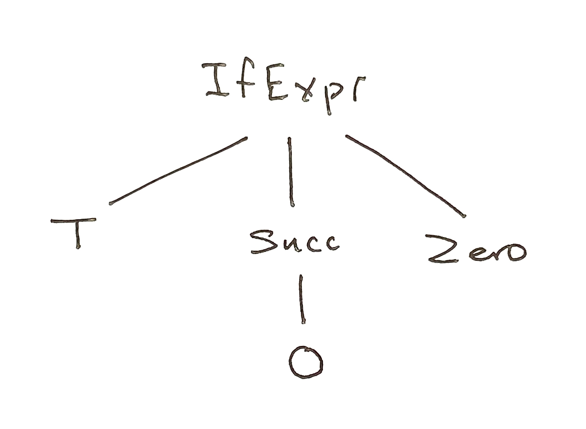

# Lesson 1

Parsers are used to "read" a piece of text and turn it into some kind of data structure.  For example, we can design a parser that takes a string like "12/31/1954" and turns it into the record 

```
    { month = 12, day = 31, year = 1954}
```

We will learn to do this shortly.  For a more elaborate example, consider this sentence in a little toy language

```
    if true then succ 0 else 0
```

When parsed, it is transformed into the data structure

```
    IfExpr T (Succ Zero) Zero)
```

While it may not look like it, this is a tree, as in the figure below.



## Primitives and combinators 

We will use the `elm/parser` package.  It consists of a small set of  *primitive parsers*, together with *combinators*, which allow one to build up complex parsers from simpler ones.  Let's begin with a `int`, which is a parser for integers:

```
$ elm repl
> import Parser exposing(..)

> run int "44"
Ok 44 : Result (List DeadEnd) Int

> run int "fourty"
Err [{ col = 1, problem = ExpectingInt, row = 1 }]
```